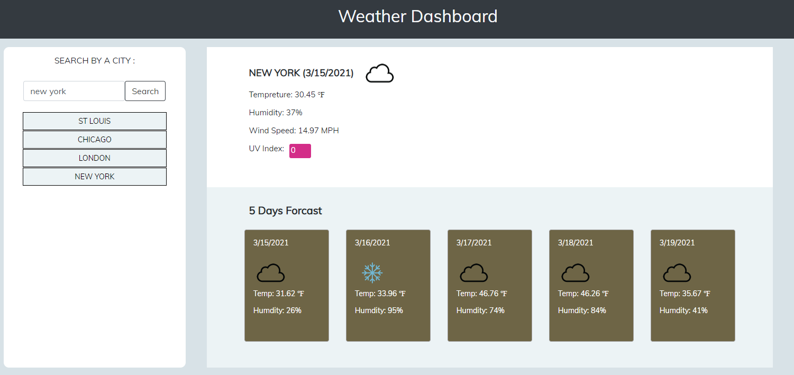

# Weather-Dashboard

A simple weather application shows Today's weather conditions (temperature, the humidity, the wind speed, and the UV index) and future forcast of next 5 days. The application leverage [OpenWeather API](https://openweathermap.org/api) to build and load the data.

**URL:** https://riheelh.github.io/Weather-Dashboard/

## Screnshot

The following image shows the web application's appearance and functionality:

